# Parcial 1 — Desarrollo de Plataformas Móviles

## Información del estudiante

- **Nombre:** Sebastian Leiton Goyes
- **Código:** 2235779
- **Evaluación:** Parcial 1
- **Asignatura:** Desarrollo de Plataformas Móviles

---

## Descripción

Este proyecto corresponde al **Parcial 1 de Desarrollo de Plataformas Móviles**, cuyo objetivo es desarrollar dos aplicaciones para la clínica **MediClinic**, utilizando diferentes tecnologías y enfoques de desarrollo.

El trabajo está dividido en dos ejercicios: una **PWA desarrollada con React** para la administración de pacientes y una aplicación **móvil desarrollada con Ionic React** para que los médicos puedan consultar y gestionar sus visitas.

Ambas aplicaciones funcionan sin backend y utilizan **localStorage** para almacenar la información y mantener la sesión del usuario.

---

# Ejercicio 1 — PWA React

## Descripción

En este ejercicio se desarrolló una **PWA con React** para la administración de pacientes de la clínica MediClinic.

La aplicación cuenta con un sistema de **login con usuarios fijos**, recuperación de sesión mediante `localStorage` y opción para cerrar sesión.

También permite visualizar una lista de pacientes y agregar nuevos pacientes mediante un formulario con los campos de **nombre, apellido, CC y teléfono**, incluyendo validaciones para los datos requeridos.

Finalmente, se implementó un **buscador de pacientes** que permite filtrar por nombre, apellido o CC. El estado de búsqueda se mantiene en el componente padre y los resultados filtrados se envían al componente encargado de mostrar la lista de pacientes.

## Funcionalidades

- Login con credenciales fijas.
- Persistencia de sesión mediante `localStorage`.
- Cierre de sesión.
- Mensaje de error para credenciales incorrectas.
- Listado de pacientes.
- Registro de nuevos pacientes.
- Validación de nombre, apellido y CC.
- Persistencia de pacientes mediante `localStorage`.
- Búsqueda por nombre, apellido o CC.
- PWA funcional.

## Evidencias

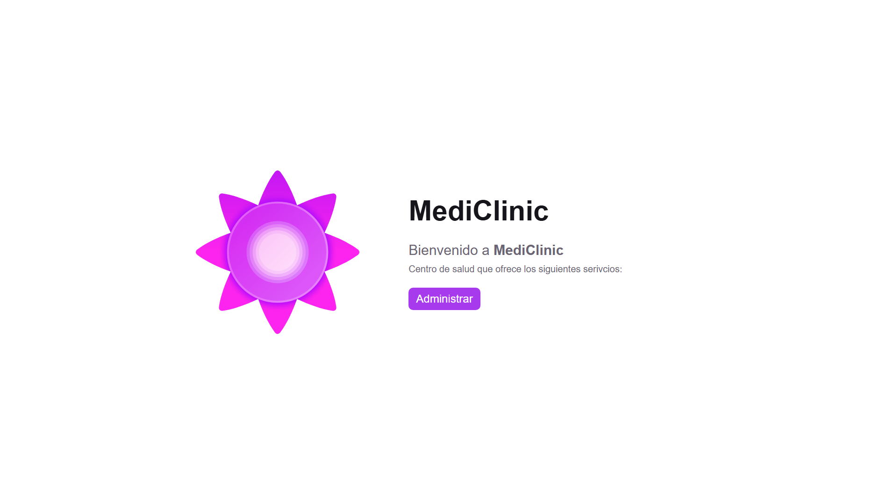
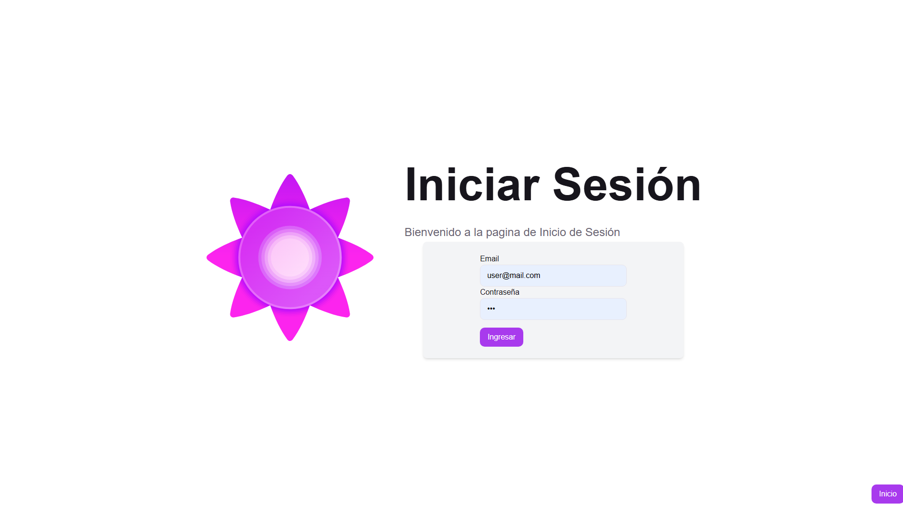
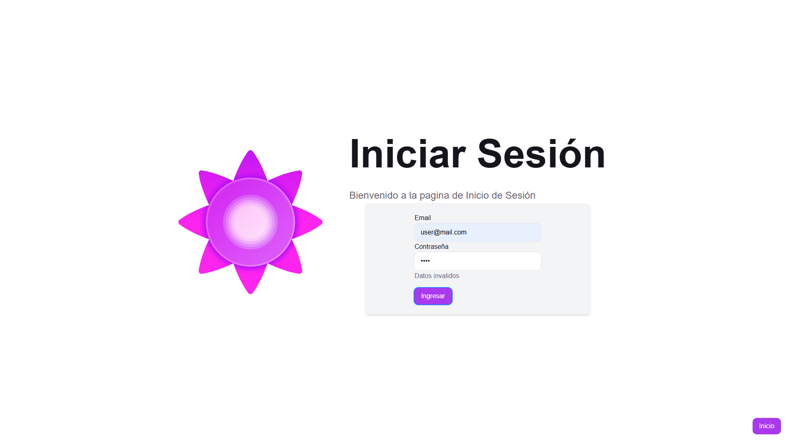

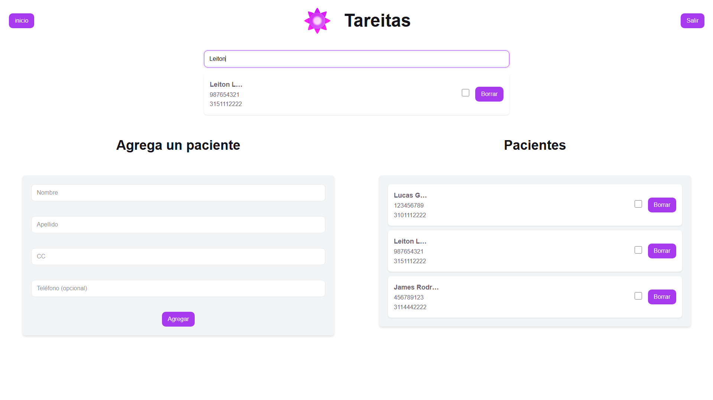
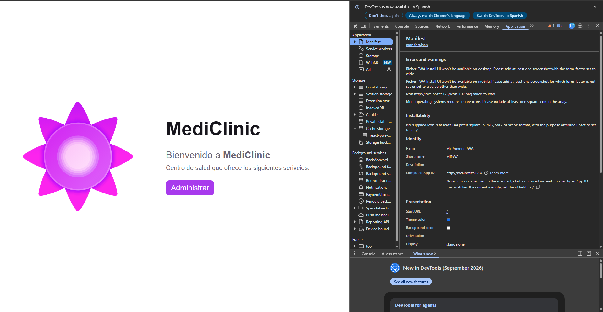
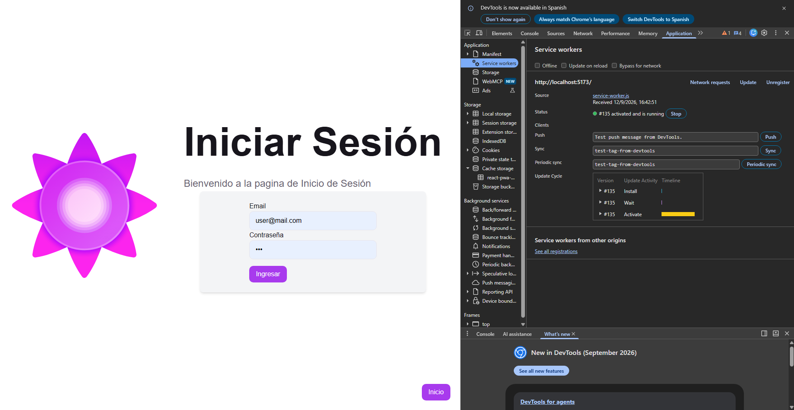

# Ejercicio 2 — Ionic React

## Descripción

En este ejercicio se desarrolló una **aplicación móvil utilizando Ionic React**, orientada a la consulta y gestión de visitas médicas.

La aplicación cuenta con un sistema de **login utilizando componentes de Ionic** y muestra un `IonToast` cuando las credenciales ingresadas son incorrectas. La sesión se almacena en `localStorage`.

Después de iniciar sesión, el médico puede navegar mediante un sistema de **IonTabs** entre las secciones de **Visitas, Pacientes y Perfil**.

En la sección de visitas se muestran las visitas correspondientes al día. Cada visita contiene información sobre el paciente, la hora y su estado. Al seleccionar una visita se accede a su detalle, donde es posible cambiar el estado siguiendo el flujo:

**Pendiente → En camino → Finalizada**

Los cambios realizados en el estado de las visitas también se almacenan en `localStorage`.

## Funcionalidades

- Login utilizando componentes de Ionic.
- `IonToast` para credenciales incorrectas.
- Persistencia de sesión mediante `localStorage`.
- Navegación mediante `IonTabs`.
- Sección de Visitas.
- Sección de Pacientes.
- Sección de Perfil.
- Listado de visitas del día.
- Visualización de paciente, hora y estado.
- Detalle de cada visita.
- Cambio de estado de las visitas.
- Persistencia de los cambios mediante `localStorage`.

## Evidencias

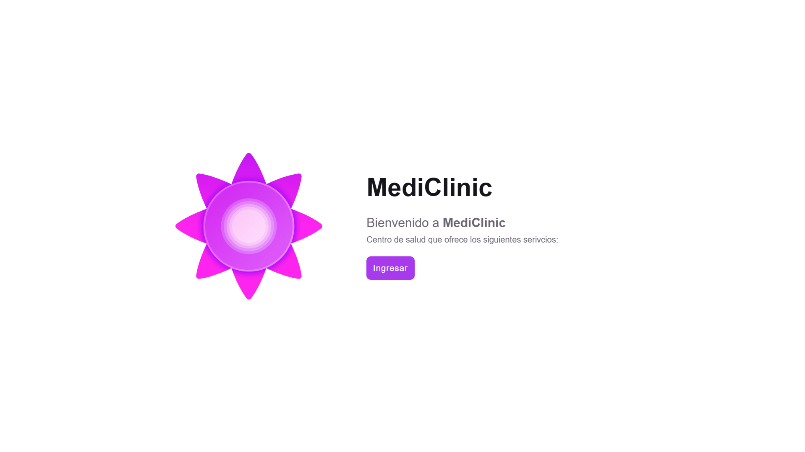
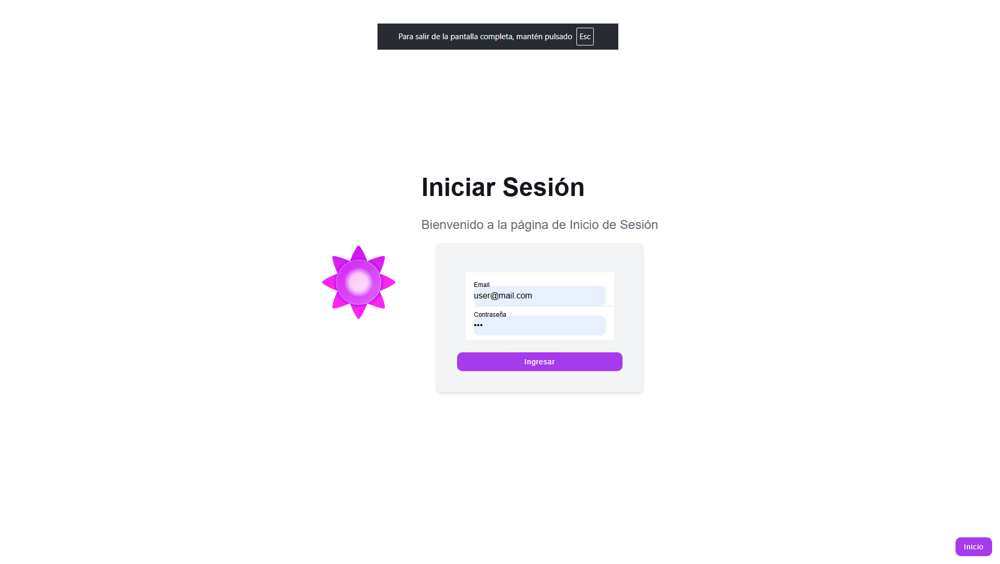
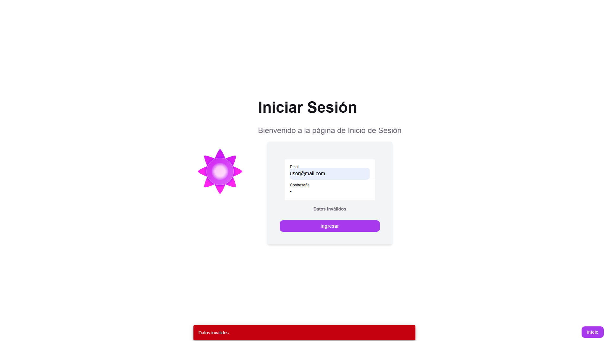
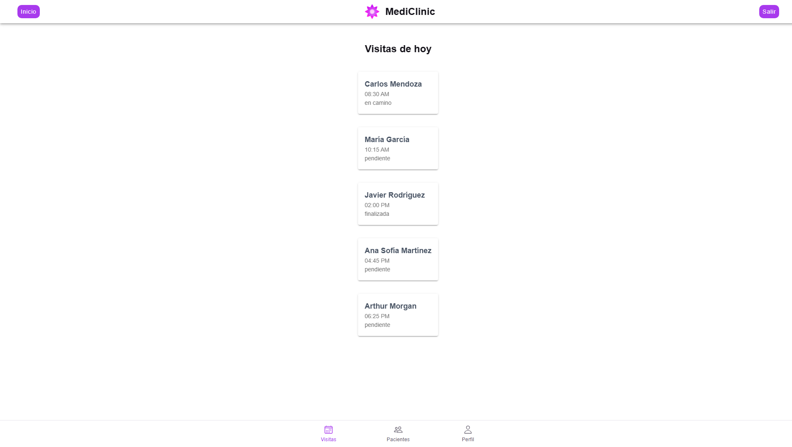
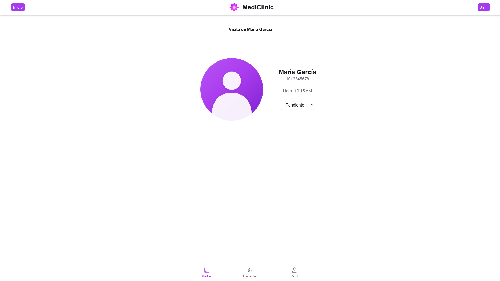
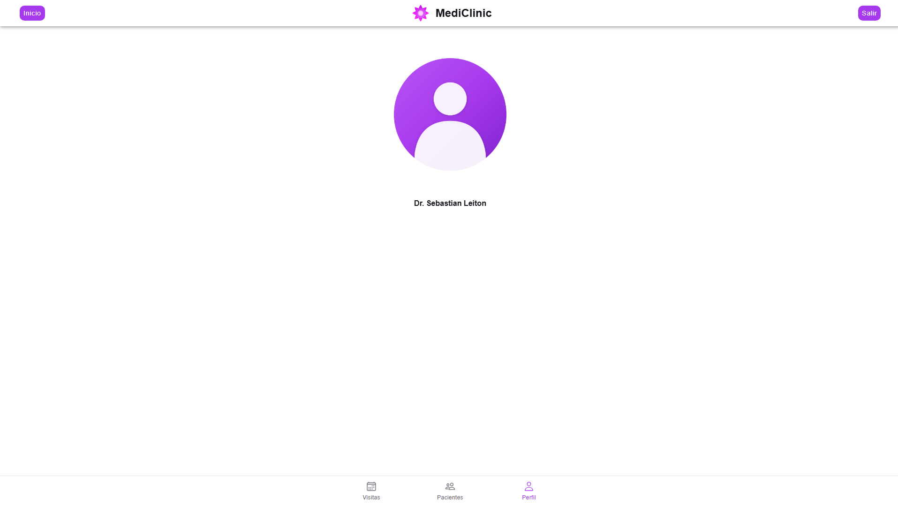
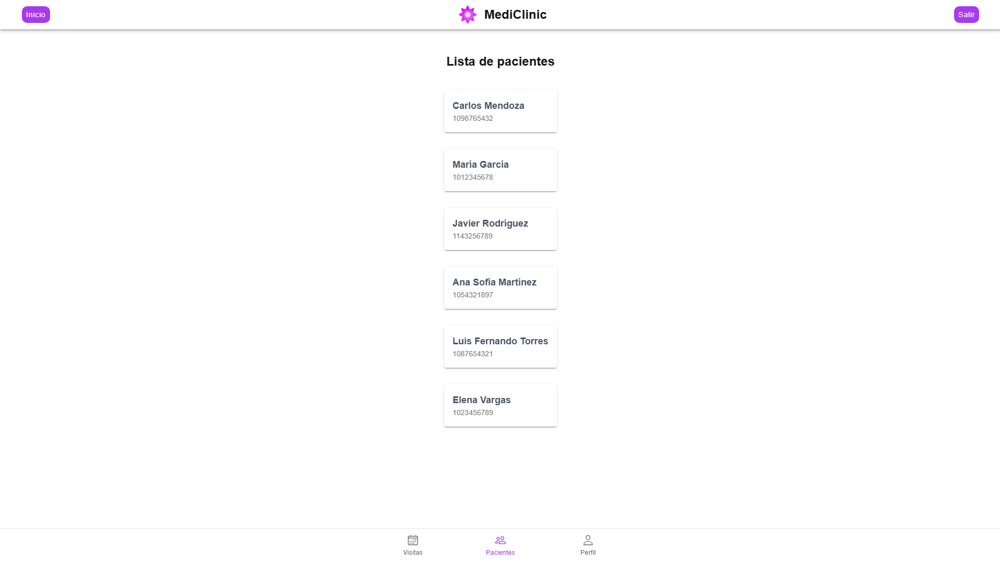

Aquí se muestran algunas evidencias de código de Ionic (de igual manera se encuentra a disposición el repositorio para verificar este código)

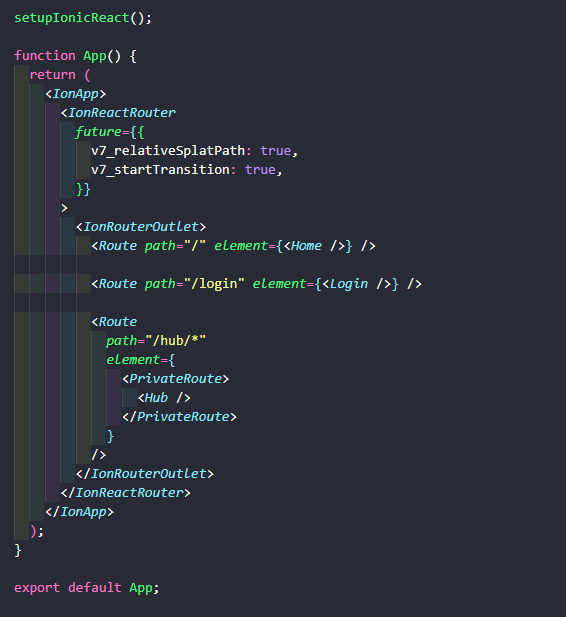
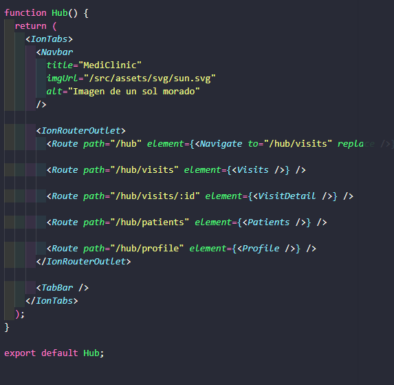
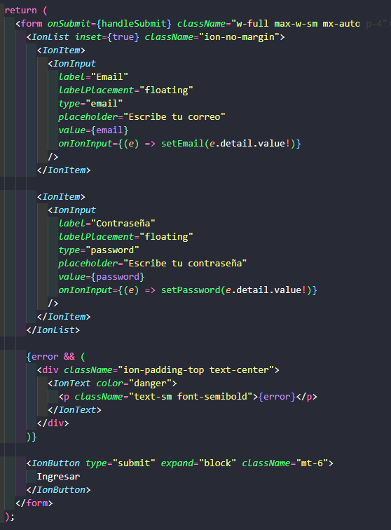
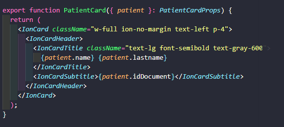

# Tecnologías utilizadas

Las aplicaciones fueron desarrolladas utilizando las siguientes tecnologías:

| Tecnología       | Uso                                                      |
| ---------------- | -------------------------------------------------------- |
| **React**        | Desarrollo de las interfaces y componentes               |
| **TypeScript**   | Tipado estático y desarrollo del código                  |
| **Vite**         | Herramienta de desarrollo y construcción del proyecto    |
| **Tailwind CSS** | Diseño y estilos de las interfaces                       |
| **Ionic React**  | Desarrollo de la aplicación móvil y componentes de Ionic |
| **LocalStorage** | Persistencia de sesiones, pacientes y visitas            |

---

# Condiciones del proyecto

- No se utiliza backend.
- La persistencia de información se realiza mediante `localStorage`.
- Las aplicaciones no comparten información de pacientes entre ellas.

---

# Rama de entrega

El trabajo corresponde a la rama:

```text
01-parcial-sebastian-leiton
```
